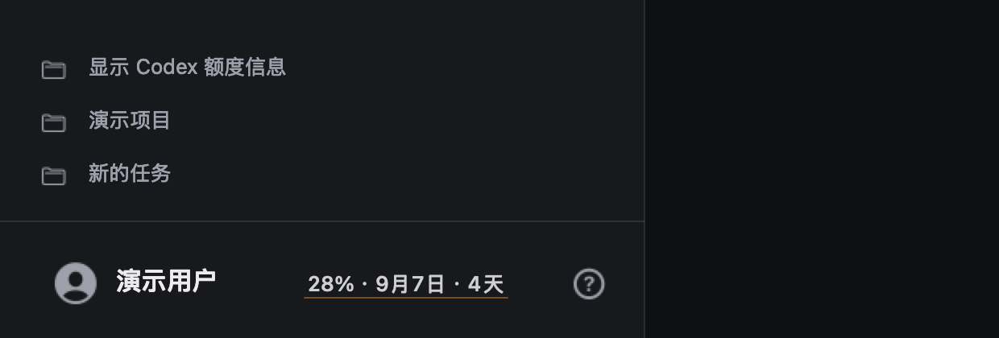
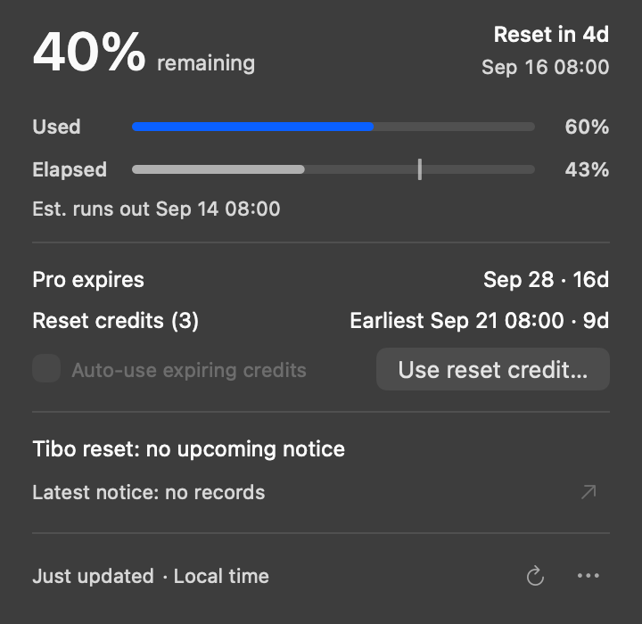

# CodexQuota

[简体中文](README.md) | **English**

An open-source macOS companion app that shows your remaining Codex quota beside your account name in the Codex Desktop sidebar. No menu-bar clutter and no modifications to the Codex app bundle.

[Download the latest release](https://github.com/MMMuFF/CodexQuota/releases/latest) · [Installation](#installation) · [Reading the indicators](#reading-the-indicators)



Hover over the quota to see cycle progress, estimated exhaustion, membership expiry, reset credits, and independent public reset announcements.



Screenshots use synthetic data. The bilingual interface and short-name layout improvements described here are available in the current source; the previously published v0.8.3 ZIP does not include them yet.

> [!IMPORTANT]
> Release ZIPs and local builds without `CODE_SIGN_IDENTITY` use ad-hoc signing and are not notarized with a Developer ID. Download only from this repository or review and build the source. Replacing or rebuilding the app may require granting Accessibility permission again.

## Features

- Remaining quota, reset date/time and calendar days until reset.
- Used quota above elapsed time, with an estimated exhaustion marker on the time bar.
- A subtle underline showing the difference between usage and elapsed time.
- Membership expiry for the current paid plan and the earliest expiring reset credit.
- Current-account subscription lookup after renewal, with same-account fallback only.
- Manual use of one reset credit after confirmation; optional per-account automatic use near expiry.
- Independent Tibo reset/credit notices and unofficial forecasts, with probability and signal-strength explanations.
- Local time-zone formatting, including date boundaries and daylight saving changes.
- Sidebar following, safe spacing around voice/help controls and progressive text shortening.
- Stays attached to a visible Codex window when another app has focus, without floating above unrelated windows.
- Hidden in settings, with the sidebar collapsed, or when Codex is minimized/hidden or not visible in the current Space.
- No Dock icon, menu-bar item, telemetry, ads, or third-party Swift dependencies.

## Languages

The app follows the first preferred system language: Chinese uses Simplified Chinese copy; all other languages use English. You can also select a language specifically for CodexQuota in macOS System Settings → General → Language & Region → Applications. Reopen CodexQuota after changing its language.

Language and time zone are independent. An English interface in Shanghai still shows Shanghai local time. Structured dates are reformatted; original third-party announcement text is preserved, not automatically translated. No translation service or extra network request is used.

## Requirements

- macOS 13 or newer.
- Codex Desktop installed at `/Applications/ChatGPT.app`, signed in to a ChatGPT account.
- Release ZIP: Apple Silicon Mac. Intel users should build from source.
- Source build: Xcode Command Line Tools and Swift 5.9 or newer.

## Installation

### Download a release

1. Download `CodexQuota.zip` from the [latest release](https://github.com/MMMuFF/CodexQuota/releases/latest).
2. Quit any existing CodexQuota instance, unzip and move `CodexQuota.app` into Applications.
3. Open the app. If macOS cannot verify the developer, verify the download source and follow macOS's Open/Privacy & Security prompts. Do not disable Gatekeeper globally.

The signature checks integrity, not a verified publisher identity or Apple notarization.

### Build from source

Check your developer tools:

```bash
xcode-select -p
swift --version
```

If needed, run `xcode-select --install` and complete Apple's installer.

```bash
git clone https://github.com/MMMuFF/CodexQuota.git
cd CodexQuota
./scripts/install.sh
```

The installer builds `.build/artifacts/CodexQuota.zip`, validates the bundle ID/version/signature, installs to `/Applications/CodexQuota.app`, and launches that fixed path. It refuses to replace an app while any CodexQuota instance is running. It does not use `sudo`, download dependencies, remove Gatekeeper quarantine on the installed app, or modify `/Applications/ChatGPT.app`.

A legacy `~/Applications/CodexQuota.app` is migrated only after bundle validation, with rollback on failure. If both locations contain copies, the installer stops instead of choosing or deleting one for you.

Without write access to system Applications:

```bash
CODEX_QUOTA_INSTALL_DIR="$HOME/Applications" ./scripts/install.sh
```

Build a ZIP without installing:

```bash
./scripts/build-app.sh
```

If you have a signing identity, you can use `CODE_SIGN_IDENTITY="Apple Development: Your Name" ./scripts/install.sh`. An Apple Development certificate is for development, not a substitute for Developer ID signing and notarization for public distribution.

## First launch and permissions

1. Open `/Applications/CodexQuota.app`.
2. Open a normal Codex task with the sidebar expanded.
3. In System Settings → Privacy & Security → Accessibility, allow CodexQuota (it may be listed as “Codex 昵称额度”).
4. Hover over the quota beside your account name.

An “Enable Accessibility” prompt opens the relevant system setting. The app reads Codex window, sidebar and account-content geometry; nickname text is used in-process only to obtain text bounds, never logged or uploaded. It does not require Screen Recording, Input Monitoring or Full Disk Access, and does not listen to global keyboard/mouse input.

The app requests login-item registration through `SMAppService`. Approve it in System Settings → General → Login Items if needed. Quitting stops the overlay and automatic credit use; it does not immediately relaunch, but can launch at the next login.

## Reading the indicators

An example compact label is `86% · Aug 4 · 7d`: remaining quota, cycle reset date and calendar days until reset. The app uses the longest Codex quota window returned by the server, not a hard-coded five-hour or seven-day cycle.

- **Used**: the quota consumed, equal to `100% − remaining`.
- **Elapsed**: the fraction of the same cycle elapsed at the most recent data refresh.
- **Vertical marker**: estimated exhaustion at the current average consumption rate. At 20% time elapsed and 50% quota used, the marker is at 40% of the cycle. At exactly reset time it is at the right edge. It is hidden if quota is expected to last beyond reset, there is insufficient data, or the data is unavailable.
- **Forecast text**: a linear estimate, not a guaranteed exhaustion time. Early-cycle estimates can vary widely.

The underline uses the absolute difference between Used and Elapsed in percentage points:

| Difference | Color |
| --- | --- |
| Up to 25 points | Neutral text color |
| More than 25, up to 50 | Orange |
| More than 50 | Red |

Positive differences mean usage is ahead of elapsed time. Color indicates magnitude, not direction; hover to compare the bars. The underline remains visible while hovering or expanding the card.

“None” means a confirmed zero; “Unavailable” means the information could not be read. If credit count is known but expiry is missing, the count remains visible. Paid-plan expiry is not guessed from an old expired token after renewal.

## Sidebar layout and actions

Quota remains attached to a visible normal task window even when another app has focus. It does not independently float above unrelated windows. Settings, a collapsed sidebar, minimized/hidden windows, and other Spaces intentionally hide it.

The overlay protects voice and help controls, including labeled buttons. When available, it uses avatar/nickname content bounds rather than the flexible account button's full click area; short names can reclaim otherwise unused space. Missing content geometry falls back conservatively. If Accessibility omits the microphone, a button-sized slot remains reserved.

Text shortens progressively: full label → `46%·9/15·5d` → `46%·9/15` → `46%`. If even the minimum width is unavailable, it hides. Hover details retain the full information. CodexQuota does not add, enable or restore Codex's voice feature.

Quota refreshes about every five minutes, on wake and via Refresh. After switching accounts, refresh manually if necessary. A failed refresh preserves the last result with a warning.

### Reset credits

Manual use is irreversible and always asks for confirmation. The account is checked again before consumption; a changed or unreadable account cancels the request.

**Auto-use expiring credits** is off by default and saved per account. Enabling it authorizes an attempt to use one credit during its last 30 minutes without a new confirmation each time.

- The expiry window is checked every minute with fresh account and credit details.
- Unknown expiry, failed refresh or an expired credit prevents automatic use.
- Uncertain network outcomes reuse the same idempotency request. Successful use does not repeatedly consume credits with the same expiry, including when several credits expire together.
- “No reset needed” does not consume a credit; checking continues within the expiry window.
- Codex's API cannot select a particular credit. The earliest expiry triggers eligibility, but Codex chooses the credit actually consumed.

Uncheck the option to stop future attempts. The app must be running, awake and online; sleep, shutdown or network failure can prevent redemption before expiry.

## Public reset notices and confidence

The app uses [Codex Resets](https://codex-resets.com/)' [public HTTP API](https://codex-resets.com/api/docs), the same data source as its MCP. No additional MCP installation or API key is needed.

- **Expected / Announced · Awaiting execution**: an explicit notice, not proof the reset has happened.
- **Pending confirmation**: the announced ETA passed without execution confirmation. Time passing does not prove completion.
- **Reset forecast (unofficial)**: the service's probability, if provided, plus Strong/Elevated/Unknown signal strength and “Not guaranteed”. Missing probabilities are not fabricated; levels are not converted into percentages.
- **No upcoming notice**: no current notice or valid forecast, not an estimate based on historical average intervals.
- **Latest notice / observation**: a published notice or third-party observation, not proof your personal quota has arrived.

These forecasts are third-party AI classifications, not commitments from Tibo or OpenAI. The API provides no historical accuracy; “80%” is not a validated success rate. A forecast's expiry is not a reset ETA. Original free-text windows without a machine-readable time zone remain original text. Explicit notices take precedence over forecasts.

All structured times use the Mac's current time zone and show minutes, not seconds. Time-zone changes reformat the display automatically. Hover Local time for the zone identifier and source details. The app does not use IP geolocation or location permission.

Public notices refresh independently at launch, wake, every five minutes and manually, respecting rate limits. Failure preserves the last successful notice in memory with a warning; it never changes personal cycle progress or automatic credit eligibility.

## Update

Quit via **More (···) → Quit…**, download the new ZIP and replace the single fixed copy in Applications. Reopen and reauthorize Accessibility if necessary.

Source users can quit and run these commands in their existing checkout:

```bash
git pull
./scripts/install.sh
```

Avoid running long-term from Downloads, temporary extraction folders or old build directories. Duplicate copies can confuse Accessibility permissions and Spotlight.

## Troubleshooting

For a missing overlay, verify a normal task is visible and the sidebar expanded:

```bash
test -x /Applications/ChatGPT.app/Contents/Resources/codex
pgrep -fl CodexQuota
codesign --verify --deep --strict /Applications/CodexQuota.app
```

If permission was granted to an old copy, quit, remove that entry from Accessibility, add the fixed installation path and reopen. Ad-hoc rebuilds may invalidate old permissions.

For unavailable quota, confirm Codex is signed in and your network/VPN can reach ChatGPT, then Refresh. For alignment or hover issues, report sanitized screenshots, all three app/OS versions, sidebar width and external-monitor/Space details. Do not post credentials or account identifiers.

## Development and validation

```bash
./scripts/run-tests.sh
./scripts/run-app-tests.sh
./scripts/build-app.sh
```

The scripts exercise core logic and AppKit in separate Chinese/English test processes without changing macOS settings. Tests use synthetic data, fake services and windows owned by the test process; they do not consume real credits or inspect the live Codex Accessibility tree. Passing tests do not validate real TCC/Gatekeeper authorization or every cross-app/Space interaction.

There are no third-party SwiftPM dependencies. Sources live in `Sources/CodexQuotaCore` and `Sources/CodexQuotaApp`. Explicit developer overrides can use `CODEX_QUOTA_CODEX_PATH`; production otherwise trusts only `/Applications/ChatGPT.app/Contents/Resources/codex`, not an arbitrary executable on `PATH`.

## Data and privacy

- Quota is read through the local `codex app-server`.
- Membership expiry uses a read-only request to `https://chatgpt.com/backend-api/subscriptions` with the current account's local login; same-account token claims are a fallback. Subscription dates are never guessed.
- Account changes discard mismatched results. Subscription and credit-detail requests use ephemeral sessions without cookies/cache and reject redirects.
- Public notice requests go only to `https://codex-resets.com/api/v1/status`, without account data, tokens, cookies or a request body. The server receives normal connection metadata such as IP. Notice/ETag caches are in memory.
- Tokens never enter UI state, project files or logs, and are not sent to third parties. There is no telemetry, advertising or analytics.
- Reset consumption uses account-scoped idempotency to reduce duplicate use after uncertain network outcomes.

CodexQuota is not an official OpenAI product and is not endorsed by OpenAI. It depends on local Codex protocols and non-public ChatGPT endpoints; upstream changes may temporarily break some features.

## Uninstall

Quit the app, disable its login item, remove its Accessibility entry, then move `/Applications/CodexQuota.app` to Trash. Optionally clear preferences only after confirming no reset request has an uncertain outcome:

```bash
defaults delete com.mufeng.codexquota
```

The app never modifies `/Applications/ChatGPT.app`, so no Codex repair or reinstall is needed.

## License

[MIT](LICENSE).
