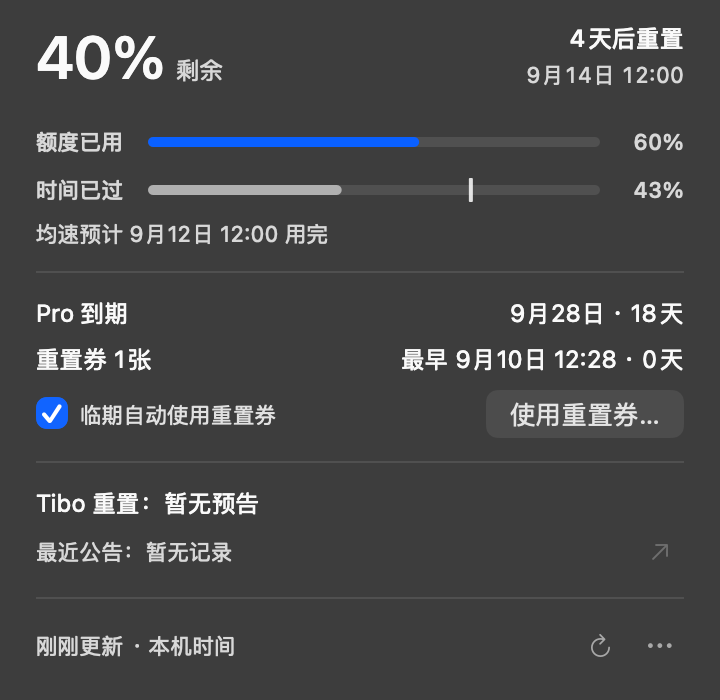

# Codex 昵称额度（CodexQuota）

一个开源的 macOS 伴生应用：在 Codex Desktop 左侧栏底部、用户昵称右侧显示额度，不占用菜单栏，也不修改 Codex 安装包。

<p align="center">
  <a href="https://github.com/MMMuFF/CodexQuota/releases/latest"><strong>下载最新版</strong></a>
  · <a href="#安装">安装说明</a>
  · <a href="#如何读懂进度">如何读懂进度</a>
</p>

<p align="center">
  
</p>
<p align="center"><sub>昵称旁常显：剩余额度 · 刷新日期 · 剩余天数；细线提示时间与消耗偏差（演示数据）</sub></p>

鼠标悬停后可查看时间/额度进度、预计耗尽时间、会员到期时间、额度刷新时间和最早到期重置券，并可手动刷新、在二次确认后使用一张重置券，或按账户开启临期自动使用。

<p align="center">
  
</p>
<p align="center"><sub>新版分区详情：先看额度与消耗，再查看权益及公共公告；勾选框为已开启示例，首次使用默认关闭（演示数据）</sub></p>

> [!IMPORTANT]
> Release ZIP，以及未指定 `CODE_SIGN_IDENTITY` 的本地构建，默认使用 ad-hoc 签名，没有 Developer ID 公证。请仅从本仓库 Release 下载，或检查源码后自行构建；更换或重新构建应用后，macOS 可能要求重新授权辅助功能。

## 功能

- 显示当前额度剩余百分比、刷新日期/具体时间和剩余天数
- 对比本周期时间进度与额度消耗进度，并按当前周期均速显示预计耗尽时间
- 常显额度下方用中性、橙色或红色细线提示额度消耗相对时间进度的偏差
- 根据当前会员类型显示 Plus、Pro 等会员到期时间
- 续费后优先读取当前账户的实时订阅日期，不再沿用旧 Token 日期
- 显示最早到期重置券及可用数量
- 可按账户勾选“临期自动使用重置券”，在最早到期券的最后 30 分钟内自动尝试使用
- 额度每 5 分钟刷新，也可在详情卡中手动刷新
- 独立显示 Tibo 公共重置/发券预告与第三方重置预测，不混入个人额度周期
- 所有结构化日期按电脑当前时区显示，切换系统时区后自动更新，无需重启
- 跟随 Codex 侧边栏移动、缩放和收起
- 识别底栏同排按钮，为语音等新增按钮预留空间；空间不足时隐藏额度组件
- 切换到其他软件时仍显示在可见的 Codex 窗口上，不抢焦点、不独立置顶
- 设置页、侧边栏收起、窗口最小化、隐藏或不在当前 Space 时自动隐藏
- 切换账户后按账户重新读取，并隔离重置券幂等请求
- 使用独立设计的额度仪表环应用图标
- 不占用 Dock、菜单栏或普通主窗口

## 系统要求

> v0.8.3 将额度条移到时间条上方，新增预计耗尽竖线，并区分公共重置预测的概率、信号强度和执行状态。完整变更见[更新说明](docs/releases/v0.8.3.md)。

- macOS 13 或更高版本
- Codex Desktop 已安装到 `/Applications/ChatGPT.app`
- 已在 Codex 中登录 ChatGPT 账户
- 下载 Release ZIP：需要 Apple Silicon（M 系列）Mac
- 从源码构建：另需 Xcode Command Line Tools 与 Swift 5.9+；Intel Mac 请使用此方式

## 安装

### 下载 Release（推荐）

1. 在 Apple Silicon（M 系列）Mac 上，从 [最新 Release](https://github.com/MMMuFF/CodexQuota/releases/latest) 下载 `CodexQuota.zip`。
2. 解压后将 `CodexQuota.app` 拖入 macOS 的“应用程序”文件夹。
3. 首次打开若 macOS 无法验证开发者，请在确认下载来源后按住 Control 键点按应用，选择“打开”，再按系统提示确认。

Release ZIP 使用 ad-hoc 签名且未经 Apple 公证。它会在打开前经过 macOS Gatekeeper 检查，但不能提供已验证开发者身份；如需完整审查，可按下方步骤从源码构建。

### 从源码安装

先检查开发工具：

```bash
xcode-select -p
swift --version
```

如果第一条命令失败，可运行 `xcode-select --install`，按 macOS 提示完成安装。

```bash
git clone https://github.com/MMMuFF/CodexQuota.git
cd CodexQuota
./scripts/install.sh
```

安装脚本会：

1. 从当前源码构建 `.build/artifacts/CodexQuota.zip`
2. 校验 Bundle ID、版本和代码签名完整性
3. 安装到 `/Applications/CodexQuota.app`
4. 从固定路径启动应用

脚本不使用 `sudo`、不联网下载依赖、不主动清除 Gatekeeper 隔离属性，也不会修改 `/Applications/ChatGPT.app`。如果任意 CodexQuota 副本仍在运行，脚本会拒绝覆盖；请先全部退出。

从旧版的 `~/Applications/CodexQuota.app` 更新时，若系统“应用程序”目录还没有同名 App，安装器会先校验 Bundle ID，再以可回滚方式迁移。若两个目录已经同时存在副本，安装器会停止并请你先确认要保留哪一个，避免误删或覆盖其他同名应用。

非管理员账户若无权写入 `/Applications`，可改装到个人应用目录：

```bash
CODEX_QUOTA_INSTALL_DIR="$HOME/Applications" ./scripts/install.sh
```

代码签名检查用于确认应用在复制过程中没有损坏，不验证发布者身份，也不代表应用经过 Apple 公证。

也可以只构建，不安装：

```bash
./scripts/build-app.sh
```

本机如有签名证书，可指定签名身份：

```bash
CODE_SIGN_IDENTITY="Apple Development: Your Name" ./scripts/install.sh
```

Apple Development 证书适合同机开发测试，不等于面向公众分发所需的 Developer ID、Hardened Runtime 与公证流程。

## 首次使用

1. 打开 `/Applications/CodexQuota.app`。
2. 打开 Codex 的普通任务页，并展开左侧栏。
3. 首次出现提示时，前往「系统设置 → 隐私与安全性 → 辅助功能」，允许“Codex 昵称额度”或 `CodexQuota`。
4. 回到 Codex；昵称右侧会显示额度，悬停即可打开详情卡。

如果昵称旁显示橙色“请开启辅助功能”，点击该提示可直接打开对应的系统设置页面；授权后应用会自动恢复额度显示。

辅助功能权限只用于读取 Codex 窗口、任务侧边栏和分隔线的几何结构，以保持额度位置正确。应用不需要屏幕录制、输入监控或完全磁盘访问，不监听全局键盘或鼠标；仅处理自身额度组件与详情卡上的悬停和点击。

应用使用 `LSUIElement` 运行，因此没有 Dock 图标、菜单栏图标或普通主窗口。退出后需要从 `/Applications/CodexQuota.app` 重新启动。

首次启动会请求通过 macOS `SMAppService` 注册登录启动。若系统要求批准，可在「系统设置 → 通用 → 登录项」中开启“Codex 昵称额度”。手动退出或崩溃后不会立刻自动拉起，只会在下次登录时启动。

## 如何读懂进度

昵称旁常显内容例如 `86% · 8月4日 · 7天`：

| 内容 | 含义 |
| --- | --- |
| `86%` | 当前剩余额度 |
| `8月4日` | 当前额度周期的刷新日期 |
| `7天` | 距离刷新剩余的天数 |

悬停后，详情卡会用同一个额度周期比较两条“已发生”进度：

- **上方「额度已用」**：本周期已经消耗的比例，即 `100% - 剩余额度`。例如常显 `86%` 时，额度进度约为 `14%`。
- **下方「时间已过」**：本周期截至最近一次刷新数据时，已经过去的比例。
- 时间条上的**小竖线**对应下方“均速预计用完”的时间点，整条轨道从周期开始延伸到重置时刻。例如时间已过 `20%`、额度已用 `50%`，竖线位于周期的 `40%` 处；竖线越靠左，预计越早耗尽。悬停时间条也可查看说明。
- 预计恰好在重置时用完时，竖线位于最右端；预计重置前用不完、尚无法估算或数据不可用时隐藏竖线，不将周期外预测压到右端伪装成周期内耗尽。
- 多个额度窗口同时存在时，应用动态选择 Codex 返回的最长周期，不固定写死为 5 小时或 7 天。
- “预计用完”按本周期开始至最近一次刷新时的平均消耗速度线性估算，仅供参考；预计晚于重置时间时显示“本轮预计用不完”，尚未消耗或周期数据不完整时显示“暂无法估算”。

常显文字下方的细线表示“额度已用进度 − 时间已过进度”的绝对偏差：

| 绝对偏差 | 细线颜色 |
| --- | --- |
| 不超过 25 个百分点 | 中性色 |
| 大于 25、但不超过 50 个百分点 | 橙色 |
| 大于 50 个百分点 | 红色 |

正偏差表示额度消耗比时间进度快，负偏差表示更慢。细线颜色只表示偏差程度；方向请悬停后对比两条进度。悬停和详情卡展开时仍保留细线；只有需要显示辅助功能警告或周期数据不可比较时隐藏。

详情卡还会显示当前套餐对应的 Plus、Pro、Team、Business 或 Enterprise 到期信息，以及所有可用重置券中最早到期的一张。“暂无”表示已确认当前为 0 张；“暂不可用”表示本次未能读取，不能理解为 0 张。数量可用但到期时间缺失时，应用会保留可用数量并明确提示到期时间暂不可用。

## 显示规则与操作

额度仅在以下条件同时满足时显示：

- Codex 位于前台
- 普通任务页处于打开状态
- Codex 主窗口可见
- 左侧栏已展开
- 昵称与右侧按钮之间有足够的可用空间

切换到其他应用不会直接隐藏额度：只要当前 Space 内 Codex 普通任务窗口及账户侧栏仍可见，额度就继续附着在原位置。它跟随 Codex 窗口层级，被其他窗口遮住时不会单独浮到其他软件上方，也不会抢焦点。

进入设置页、收起侧边栏、最小化或隐藏 Codex，或当前 Space 没有可见的 Codex 普通任务窗口时隐藏，属于预期行为。

底栏有语音等新增按钮时，额度会按其实际宽度让位，包括带文字的按钮。如果辅助功能没有单独返回麦克风，仍会在问号左侧保守保留一个按钮位，不把漏识别视为可占用空间。空间较小时使用 `46%·9/15·5天` 这样的精简格式，更窄时仅显示百分比，完全放不下时隐藏；拉宽后恢复完整文字，悬停详情始终保留完整信息。CodexQuota 不会新增或开启 Codex 的语音入口，该入口是否显示由 Codex 自身决定。

如果退出 CodexQuota 后麦克风仍未出现，就不是当前额度覆盖层挡住了按钮。本机 0.7.2 的对照验收已确认预留位置空出，但原生入口在小程序退出后仍未显示；空间避让不代表恢复了 Codex 的语音功能。

应用约每 5 分钟自动读取一次，也可以在详情卡中点击“刷新”。切换账户后建议手动刷新；若刷新失败但已有缓存，界面会继续显示上一次结果并给出提示。

“使用重置券”是不可逆操作，应用会显示二次确认；发送消费请求前会重新校验稳定账户 ID，不一致或无法读取时取消操作。

### 临期自动使用重置券

在详情卡底部勾选“临期自动使用重置券”，即可授权该账户在临期时自动兑换，无需每次弹窗确认。默认关闭，勾选状态按账户保存；换到未开启过的账户时保持关闭。

- 最早到期券进入到期前 **30 分钟**后，每分钟刷新检查一次，满足条件就尝试使用 **1 张**。
- 只使用刚刚读取到的有效账户与券详情；到期时间不可用、刷新失败、券已过期时不自动兑换。电脑唤醒后会重新检查。
- 网络结果不明确时，沿用同一请求重试。同一账户、同一到期时间在确定兑换成功后不再自动连兑；多张券同一时间到期时也不会一次性全部使用。
- 如果 Codex 返回“当前无需重置”，不会消耗券，会在临期窗口内继续检查。
- Codex 接口不支持指定某张券；应用以最早到期时间判断是否触发，实际使用哪张券由 Codex 决定。

取消勾选可停止后续自动尝试。功能需要 CodexQuota 持续运行、电脑唤醒且网络可用；退出、关机或睡眠期间无法兑换，也无法保证网络故障时一定能赶在过期前使用。

## 更新

### Release ZIP 用户

1. 在详情卡右下角点击“··· → 退出…”。
2. 从 [最新 Release](https://github.com/MMMuFF/CodexQuota/releases/latest) 下载并解压新的 `CodexQuota.zip`。
3. 用新版本替换 `/Applications/CodexQuota.app`，然后重新打开。
4. 如果额度不再显示，请在“辅助功能”设置中移除旧条目并重新授权稳定安装路径下的应用。

### 源码安装用户

先在详情卡右下角点击“··· → 退出…”，再运行：

```bash
cd /path/to/CodexQuota
git pull
./scripts/install.sh
```

请把 `/path/to/CodexQuota` 替换为首次克隆时的仓库目录。只在 `/Applications/CodexQuota.app` 保留一个稳定副本。不要从下载目录、临时解压目录或旧构建目录长期运行，否则 macOS 辅助功能授权和 Spotlight 可能指向不同副本。

## 验证与开发

运行核心逻辑检查：

```bash
./scripts/run-tests.sh
```

检查实际 AppKit 勾选框、悬停下划线与自动兑换接线（使用演示数据和模拟服务，不消耗真实重置券）：

```bash
./scripts/run-app-tests.sh
```

当前包括 61 项核心检查与 19 项 AppKit 检查，覆盖额度解析、本机时区/跨日/夏令时、公共公告与预测语义、HTTP 缓存/限流/凭据隔离、账户隔离、重置券安全策略、窗口定位几何、后台显示策略、分区布局和实际组件渲染。包含进度条排序、预计耗尽竖线位置与边界、预测强度/风险提示，以及连续 100 次重复更新与鼠标感应区域稳定性回归。AppKit 测试用模拟定位器和测试进程自有窗口验证层级、跟随及隐藏恢复，不读取真实 Codex 辅助功能界面；不覆盖真实辅助功能授权、TCC、Gatekeeper、跨应用/Space 切换及完整交互。

也可在不同默认时区下检查日期逻辑（只影响该测试进程，不修改 macOS 设置）：

```bash
TZ=Pacific/Honolulu ./scripts/run-tests.sh
```

源码没有第三方 SwiftPM 依赖。关键目录：

```text
Sources/CodexQuotaCore/   数据解析与安全策略
Sources/CodexQuotaApp/    AppKit 覆盖层与交互
Tests/                    零第三方依赖测试入口
scripts/                  构建、安装与检查脚本
```

开发调试时如需测试另一份 Codex 可执行文件，可显式设置 `CODEX_QUOTA_CODEX_PATH`。正式使用默认只信任 `/Applications/ChatGPT.app/Contents/Resources/codex`，不会执行 `PATH` 中任意同名程序。

## 故障排查

### 完全不显示

先确认 Codex 在普通任务页、侧边栏已展开且窗口位于前台，然后运行：

```bash
test -x /Applications/ChatGPT.app/Contents/Resources/codex
pgrep -fl CodexQuota
codesign --verify --deep --strict "/Applications/CodexQuota.app"
```

### 已授权辅助功能但仍不显示

检查是否授权了下载目录或旧解压目录中的同名副本。退出应用，在辅助功能列表中移除旧条目，只保留 `/Applications/CodexQuota.app`，重新添加后再启动。

ad-hoc 重新构建会改变代码签名。如果旧授权失效，请退出应用、移除旧权限条目、重新添加稳定安装路径，再启动。

### 显示“读取失败”

确认 Codex 已登录、固定 `codex` 路径存在且网络/VPN 可访问 ChatGPT，然后在详情卡中点击“刷新”。

### 出现多个同名应用

只保留 `/Applications/CodexQuota.app`。删除下载目录和旧构建目录中手动解压的 `.app`，不要修改 Spotlight 数据库。仓库内的 `.build` 可以用 SwiftPM 常规清理命令重新生成。

### 错位、拖动后消失或悬停无响应

先退出并从稳定路径重开。若仍可复现，请在 Issue 中提供脱敏截图、macOS/Codex/CodexQuota 版本，以及是否使用副屏、设置页或临时对话框。

## Tibo 公共重置公告与本机时区

悬停卡中单独显示 [Codex Resets](https://codex-resets.com/) 追踪的公共公告。应用直接读取其[公开 HTTP API](https://codex-resets.com/api/docs)，与该服务的 MCP 使用同一数据源，不需要另装 MCP 或配置 API Key。

- **Tibo 重置：预计 9月12日 09:30**：有明确时间的公共重置预告，下方标注“已预告 · 待执行”，不把预告视为已发生。发放重置券的事件会标为“发券”。这不是自己账户的周期重置时间。
- **已预告，时间待定**：来源没有给出具体执行时间，不用公告发布时间冒充重置时间。
- **待确认**：预计时间已过，但数据源尚未确认完成，不自行判定重置已执行。
- **重置预测（非官方）：80%**：显示接口提供的预测百分比；缺失时写“概率未提供”，不自行估算。下方同时显示“信号较强 / 信号增强 / 强度未知 · 非执行保证”，对应服务提供的 `strong` / `elevated` / 未知级别，不从信号等级推导概率。
- 预测属于第三方 AI 分类，不是 Tibo 或 OpenAI 的承诺。接口未提供历史命中率，`80%` 不代表经过验证的八成准确率。预测有效期不等于预计重置时间；无机器可读时区的预测原文只在提示中保留，不擅自转换成确定时间。明确预告优先于预测，不把预测概率附加给预告。
- **暂无预告**：成功读取后确实没有有效预告/预测，不按历史平均间隔猜下一次日期。
- **最近重置公告/最近发券公告**显示公告发布时间，无当前预告/预测时标注“已发布公告 · 非个人到账确认”；观测来源则标注“第三方观测 · 非官方确认”。公告不代表每个账户实际到账的精确时刻；“查看来源”可打开对应原文。

所有结构化时间，包括个人额度、会员、重置券及公共公告，均按 **macOS 当前系统时区**显示，具体时间精确到分钟，会员到期保持简短日期。例如同一时刻在上海显示 `9月12日 09:30`，在洛杉矶夏令时显示 `9月11日 18:30`。程序不通过 IP 或定位权限猜地区；电脑切换时区后会自动重排，悬停底部“本机时间”可查看所用时区和第三方数据说明。

公告在启动、唤醒、每 5 分钟及手动刷新时独立读取，遵守服务限流；失败时保留本次运行中上次成功的公告并明确标记，首次读取失败则显示“暂不可用”。公告不会改变个人额度进度、预计耗尽时间或自动用券条件。

## 数据与隐私

- 额度百分比和刷新时间优先由本机 `codex app-server` 读取。
- 会员到期时间优先使用当前账户的本机登录态，从 `https://chatgpt.com/backend-api/subscriptions` 发出只读 HTTPS GET；失败时才回退 `~/.codex/auth.json` 中同账号 Token 的订阅日期。
- 实时订阅日期和套餐类型按同一账户原子更新；请求前后若检测到账户变化，会丢弃本次结果。插件不会自行推算续费日期。
- 订阅与重置券详情请求都只发往 `https://chatgpt.com`，使用无 Cookie、无缓存的临时会话，并拒绝重定向。
- 公共公告只向 `https://codex-resets.com/api/v1/status` 发出独立 HTTPS GET；不携带账号、Token、Cookie 或请求体，拒绝重定向。服务端会收到正常网络连接信息（如 IP）；应用不额外发送个人数据。公告和 ETag 仅缓存在内存中，失败不影响账号额度。
- Token 不写入日志、不进入 UI 状态、不持久化到项目，也不会发送给第三方。
- 不包含遥测、广告、统计或追踪。
- 重置券消费使用按账户和时间隔离的幂等请求 ID，降低网络结果不明时重复消费风险。

CodexQuota 不是 OpenAI 官方产品，与 OpenAI 无隶属或背书关系。应用依赖 Codex 本机协议和 ChatGPT 的非公开接口；上游更新可能导致部分功能暂时不可用。

## 卸载

1. 在详情卡右下角点击“··· → 退出…”。
2. 在「系统设置 → 通用 → 登录项」中关闭“Codex 昵称额度”。
3. 在「系统设置 → 隐私与安全性 → 辅助功能」中移除对应权限。
4. 将 `/Applications/CodexQuota.app` 移到废纸篓。

如需同时清除本机偏好，可在确认没有结果不明的重置券请求后运行：

```bash
defaults delete com.mufeng.codexquota
```

应用从未修改 `/Applications/ChatGPT.app`，因此无需修复或重装 Codex。

## 许可证

[MIT](LICENSE)
